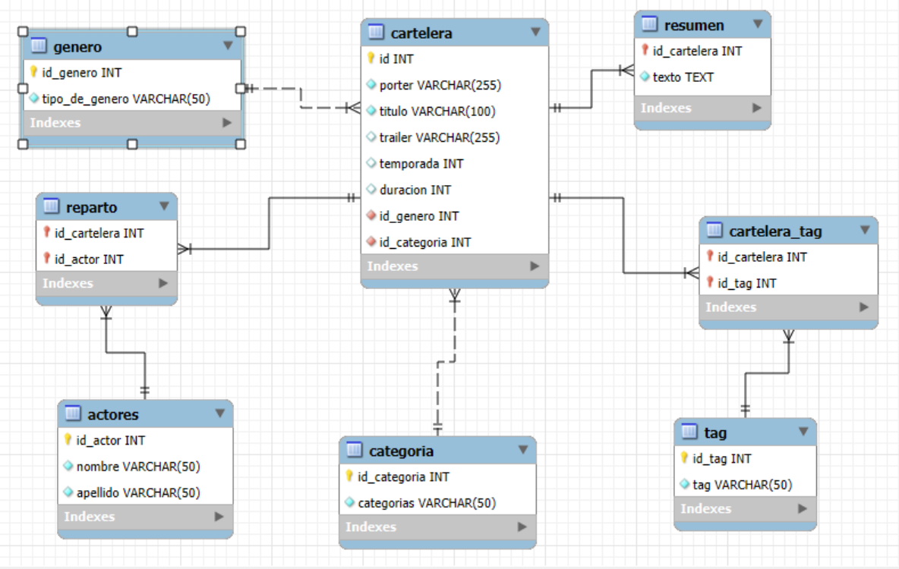

# Trailerflix
## Entrega Final Grupo 7

------
- Indice
  - [Tecnologías usadas](#-tecnologías-usadas)
  - [Diagrama](#-modelo-trailerflix)
  - [Variables de entorno](#-variables-de-entorno)
  - [Consultas SQL:](#-consultas-sql)
    - [Obtener una lista de películas por género](#-obtener-una-lista-de-películas-por-género)
    - [Obtener películas con los tags "Aventura" y "Ciencia Ficción", o "Aventura" y "Fantasía"](#-obtener-películas-con-los-tags)
    - [Visualizar títulos y categorías cuyo resumen contenga la palabra "misión"](#-resúmenes-con-misión)
    - [Listar las series con al menos 3 temporadas](#-series-con-al-menos-3-temporadas)
    - [Contar cuántas películas o series trabajó el actor Chris Pratt](#-contar-cuántas-películasseries-trabajó-el-actor)
    - [Mostrar nombre completo de actrices/actores con título, categoría y género](#-actores-con-datos-de-trabajos)
    - [Ver solo películas](#-ver-películasseries)
    - [Ver solo series ](#-ver-películasseries)
    - [Película/serie con más y menos actores](#-películaserie-con-más-y-menos-actores)
    - [Contar la cantidad total de películas](#-contar-la-cantidad-total-de-películasseries)
    - [Contar la cantidad total de series](#-contar-la-cantidad-total-de-películasseries)
    - [Listar las series en orden descendente](-listar-las-series-en-orden-descendente)
    - [Agregar el campo fecha de lanzamiento](-agregar-el-campo-fecha-de-lanzamiento)
    - [Buscar películas por palabra ](#-buscar-películas-por-palabra)
    - [Agregar una tabla Ranking](#-agregar-una-tabla-ranking)
  ------


## 🚀 Tecnologías usadas

Este proyecto fue desarrollado utilizando las siguientes tecnologías:

- [Node.js](https://nodejs.org/)
- [dotenv](https://www.npmjs.com/package/dotenv)
- [Express](https://expressjs.com/)
- [Sequelize](https://sequelize.org/)
- [MySQL](https://www.mysql.com/) (usado junto con MySQL Workbench para administrar la base de datos)


## 📊 Modelo Trailerflix
<div style="text-align: center;">
  
</div>

## 🔐 Variables de entorno

Este proyecto utiliza un archivo `.env` para guardar información sensible o de configuración, como los datos de conexión a la base de datos.

Ejemplo de las variables necesarias:


| Variable       | Descripción                   | Ejemplo        |
|----------------|-------------------------------|----------------|
| `DB_HOST`      | Dirección del servidor         | `localhost`    |
| `DB_PORT`      | Puerto de conexión             | `3306`         |
| `DB_USER`      | Usuario de MySQL               | `root`         |
| `DB_PASSWORD`  | Contraseña de MySQL            | `totoro`       |
| `DB_NAME`      | Nombre de la base de datos     | `carteleradb`  |
| `DB_DIALECT`   | Dialecto utilizado por Sequelize | `mysql`     |

## 📁 Estructura de los endpoint

```
/ingenias
├── /rutaCat
│   └── /:nombre                              → muestra pelis/series del nombre de la categoria ingresada
│   └── /contar/:nombre                       → muestra la cantidad de pelis/series del nombre de la categoria ingresada
│
├── /rutasAct
│   └── /contar/:nombre                       → muestra la cantidad de pelis/series del nombre del actor ingresado
│   └── /mostrar                              → muestra el actor junto a las pelis/series en las que trabajo
│
├── /rutasCate
│   └── /mision/:palabra                      → muestra pelis/series en las que aparece la palabra ingresada en su resumen
│   └── /pelisGenero/:genero                  → muestas las pelis del genero ingresado
│   └── /serieTem                             → muestra las series con cantidad de temporadas mayor igual a 3
│   └── /ordenDesc                            → muestra las series en orden descendente segun la cantidad de temporadas
│   └── /buscar/:palabra                      → muestra las peliculas cuya palabra ingresada este en su titulo o descripcion 
│   └── /peliTags/:tag1/:tag2                 → muestra las peliculas que contengas uno o ambos tags ingresados 
│   └── /                    →
│   └── /                    →
│   └── /                    →
│   └── /                    →
```
## 🧮 Consultas SQL

### 🎬 Obtener una lista de películas por género

1. Obtener una lista de películas por género (por ejemplo: **"Acción"**, **"Terror"**, **"Suspenso"**).

```
GET  /ingenias/pelisGenero/nombre_del_genero
```
```
dado un nombre de un genero se muestran las peliculas de este 
```

### 🧭 Obtener películas con los tags

2. Obtener películas con los tags **"Aventura" y "Ciencia Ficción"**, o **"Aventura" y "Fantasía"**.
```
GET  /ingenias/peliTags/nombre_tag1/nombre_tag2
```
```
dado dos nombres de  tag muestra muestra las peliculas que los contengan 

```


### 🕵 Resúmenes con "misión"

3. Visualizar títulos y categorías cuyo resumen contenga la palabra **"misión"**. 

```
GET  /ingenias/rutasCate/mision/palabra_a_buscar
```
```
 dado una palabra busca en los resumenes y muestra sus  pelis/series  correspondientes
```


### 📺 Series con al menos 3 temporadas
4. Listar las series con **al menos 3 temporadas**.

```
GET  /ingenias/rutasCate/seriesTem
```

### 👤 Contar cuántas películas/series trabajó el actor

5. Contar cuántas películas/series trabajó el actor **Chris Pratt**.

```
GET   /ingenias/rutasAct/contar/Nombre_del_actor
```
```
da como resultado la cantidad de pelis/series en las que participo el actor
```

### 🎭 Actores con datos de trabajos

6. Mostrar nombre completo de actrices/actores junto a:  título de los trabajos, categoría y género.
```
GET    /ingenias/rutasAct/mostar
```
```
da como resultado todos los actores junto a sus pelis/series
```
### 🔠 Ver películas/series

7. Ver solo la categoría **"Películas"**:  
   mostrar título en mayúsculas, género en mayúsculas, tags separados por coma, duración y enlace al tráiler.
8. Ver solo la categoría **"Series"**:
   mostrar título en mayúsculas, género en mayúsculas, tags separados por coma, cantidad de temporadas, tráiler y resumen.
```
GET   /ingenias/rutasCat/Nombre_de_categoria
```

```
muestra las pelis/series de la categoria dada
en este caso solo se limita a las categorias "Películas" y "Serie"

```


### 👥 Película/serie con más y menos actores

9. Identificar la película/serie con **más actores** y la que tiene **menos actores**, indicando la cantidad en cada caso.

```
GET  /ingenias
```

### 🎬 Contar la cantidad total de películas/series

10. Contar la cantidad total de **películas** registradas.
11. Contar la cantidad total de **series** registradas.
 ```
GET  /ingenias/rutasCat/contar/nombre_de_categoria
 ```

``` 
da como resultado la cantidad de la series/peli que existen de la categoria dada

``` 

### 🔢 Listar las series en orden descendente

12. Listar las series en orden **descendente por cantidad de temporadas**.

```
GET  /ingenias/rutasCate/ordenDesc
```

### 🗓️ Agregar el campo fecha de lanzamiento

13. Agregar el campo `fecha_lanzamiento` (tipo `DATE`) a la tabla de trabajos fílmicos y actualizar las fechas de los títulos del género **"Aventura"**.

```
GET  /ingenias
```

### 🔍 Buscar películas por palabra

14. Buscar películas por **palabra clave** en título o descripción (por ejemplo: **"Aventura"**, **"madre"**, **"Ambientada"**).

```
GET  /ingenias/rutasCate/buscar/palabra_a_buscar
```

### 🏆 Agregar una tabla Ranking 

15. Agregar una tabla **"Ranking"** con: ID de película o serie, calificación y comentarios.  

```
GET  /ingenias
```


## 👩‍💻 Autor
 [Lizeth](https://github.com/Liizeth/) 🦋<br> 
